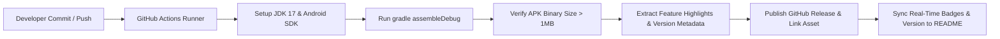

# 💸 KhataTrack — Smart Personal Ledger & Financial Tracking

[](https://developer.android.com)
[](https://kotlinlang.org)
[](https://github.com/imsovikde/Khatatrack/actions/workflows/ci.yml)
[](https://github.com/imsovikde/Khatatrack/actions/workflows/release-apk.yml)
[](https://github.com/imsovikde/Khatatrack/releases/latest)
[](LICENSE)

**KhataTrack** is a brand-minimalist, high-performance personal ledger Android application created by **[Souvik Dey](https://github.com/imsovikde)**. It empowers users to seamlessly manage financial transactions, track money given and received, schedule automated background debt reminders, and analyze personal financial health with smart AI enhancements.

---

## ⚡ Quick Navigation

[🚀 Download Latest APK (v1.0.17)](https://github.com/imsovikde/Khatatrack/releases/latest) · [✨ Features](#-key-capabilities) · [🛠️ Quick Start](#%EF%B8%8F-quick-start) · [🏗️ Architecture](docs/architecture.md) · [📦 All Releases Archive](https://github.com/imsovikde/Khatatrack/releases) · [🤝 Contributing](CONTRIBUTING.md) · [🛡️ Security](SECURITY.md)

---

## 🌟 Key Capabilities

| Emoji | Feature | Overview & Benefit |
| :---: | :--- | :--- |
| 💸 | **Financial Ledger** | Instant transaction tracking for money lent, borrowed, given, and received with real-time balance calculations. |
| 🔔 | **Smart Reminders** | System `AlarmManager` & `BootReceiver` integrations ensuring financial reminders persist across device reboots. |
| 🏷️ | **Smart Categorization** | Multi-tag categorisation for contacts and transactions to track pending debts and settled accounts easily. |
| 🎨 | **Vectorized Premium UI** | Sleek Material 3 layout built completely with Jetpack Compose, dynamic color themes, and custom vector icons. |
| 🤖 | **AI-Enhanced Insights** | Server-side Gemini API and Firebase integration for smart voice-to-ledger transcription and financial summaries. |
| 📱 | **Direct APK Download** | Every single push automatically triggers a GitHub Release with an updated, downloadable APK package! |

---

## 📱 Screenshots & Visual Design

```
+-----------------------------------+       +-----------------------------------+
| 💸 KhataTrack            [Souvik] |       | 🔔 Reminder Details               |
+-----------------------------------+       +-----------------------------------+
| Total Balance: ₹ 14,500           |       | Person: Rahul Sharma              |
| [ + Give ]        [ - Receive ]   |       | Amount: ₹ 2,500                   |
+-----------------------------------+       | Due Date: Tomorrow, 10:00 AM      |
| Recent Ledger Entries:            |       | Alarm: Scheduled Active           |
| • Rahul Sharma       + ₹ 2,500  |       +-----------------------------------+
| • Priya Verma        - ₹ 1,200  |       | [ Notify via SMS ]  [ Mark Paid ] |
+-----------------------------------+       +-----------------------------------+
```

---

## ⚙️ Requirements & Technical Stack

- **Target SDK**: Android 14 / 15 (API Level 36)
- **Minimum SDK**: Android 7.0 (API Level 24)
- **UI Framework**: Jetpack Compose + Material 3
- **Language & Runtime**: Kotlin 2.0+ & JDK 17
- **Database & Storage**: Room Database + Firebase Firestore & Auth
- **Background Tasks**: Android WorkManager & AlarmManager
- **Build System**: Gradle Kotlin DSL (`build.gradle.kts`)

---

## 🛠️ Quick Start

### 1. Download Pre-built APK

You can download the ready-to-install Android APK directly from the [GitHub Releases Page](https://github.com/imsovikde/Khatatrack/releases/latest). All previous versions remain stored and downloadable.

### 2. Build from Source

Clone the repository and compile using the Gradle wrapper:

```bash
# Clone the repository
git clone https://github.com/imsovikde/Khatatrack.git
cd Khatatrack

# Copy sample environment configuration
cp .env.example .env

# Build debug APK locally
./gradlew assembleDebug
```

The output APK will be located at:
```text
app/build/outputs/apk/debug/app-debug.apk
```

### 3. Run Unit Tests

```bash
# Run unit tests
./gradlew testDebugUnitTest

# Run Roborazzi screenshot UI tests
./gradlew verifyRoborazziDebug
```

---

## 🚀 Automated APK Build & Real-Time Release Pipeline

KhataTrack features a fully automated **Continuous Integration & Continuous Delivery (CI/CD)** pipeline powered by GitHub Actions (`.github/workflows/release-apk.yml`).

### Live Real-Time Pipeline Workflow:



1. **Automatic Build on Every Commit**: Every push to any branch triggers an automated build.
2. **Binary Verification**: Compiles the codebase and verifies the output `.apk` binary size (`> 1MB`).
3. **Real-Time README Synchronization**: Updates the README version badge, download links, and live workflow status badges in real time.
4. **Permanent Archive**: All previous APK releases and release notes remain permanently archived in the [Releases History Section](https://github.com/imsovikde/Khatatrack/releases).

---

## 📁 Repository Structure

```text
Khatatrack/
├── .github/
│   ├── ISSUE_TEMPLATE/       # Structured bug and feature templates
│   ├── workflows/            # GitHub Actions CI & Release Workflows
│   │   ├── ci.yml            # Automated lint and test workflow
│   │   └── release-apk.yml   # Real-time automated APK compilation & release
│   ├── CODEOWNERS            # Owner details (@imsovikde)
│   └── dependabot.yml        # Automated dependency updates
├── app/                      # Android application module
│   ├── src/main/             # Jetpack Compose UI, Room DB, Firebase services
│   └── build.gradle.kts      # App module Gradle configuration
├── docs/                     # Extended technical documentation
│   └── architecture.md       # Architecture specification
├── AGENTS.md                 # Context instructions for AI coding assistants
├── CHANGELOG.md              # Project version history
├── CONTRIBUTING.md           # Guidelines for contributing
├── LICENSE                   # MIT License
├── SECURITY.md               # Vulnerability disclosure policy
├── SUPPORT.md                # Community support channels
└── README.md                 # Project landing page
```

---

## 🧑‍💻 Author & Maintainer

Created with ❤️ by **[Souvik Dey](https://github.com/imsovikde)**.

- **GitHub**: [@imsovikde](https://github.com/imsovikde)
- **Repository**: [imsovikde/Khatatrack](https://github.com/imsovikde/Khatatrack)

---

## 📜 License

This project is licensed under the [MIT License](LICENSE) — see the file for details.
